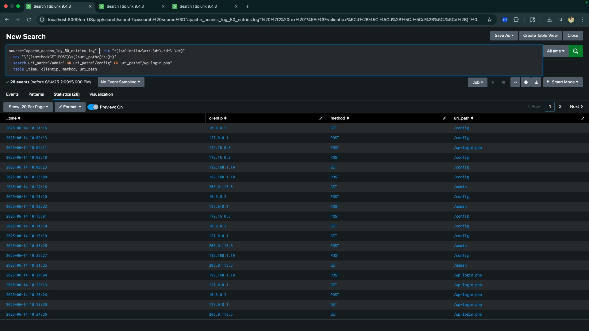
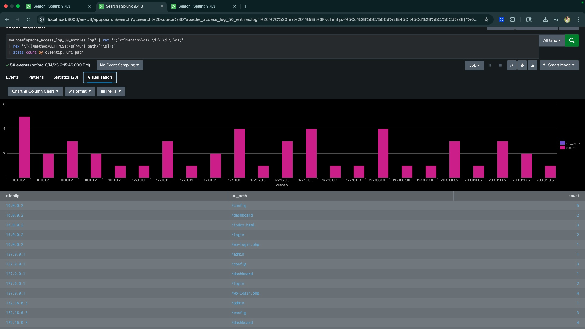
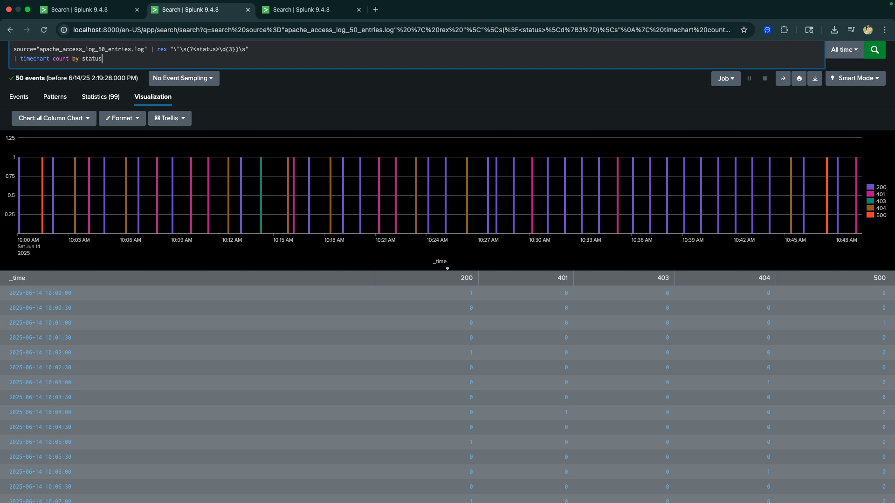

# SOC DETECTION LAB

## Objective

The SOC Detection Lab project was created to simulate real-world cyber threat detection within a controlled environment. The primary objective was to ingest and analyze Apache access logs using a Security Information and Event Management (SIEM) system (Splunk), in order to detect signs of brute-force attacks, unauthorized access, and reconnaissance behavior. 
### Skills Learned

- Proficiency in analyzing and interpreting Apache access logs to identify suspicious patterns and potential threats.
- Strong understanding of HTTP status codes and their significance in identifying malicious behavior.
- Ability to generate and recognize attack signatures and patterns.
- Built and executed queries to investigate attack signatures and uncover trends in failed login attempts or unauthorized access.
- Practiced documenting threats clearly with screenshots, search queries, and written explanations of what was observed.

### Tools Used

- SPLUNK
- Apache Access Logs

## Steps

### Ref 1: Raw Log Data View

This screenshot shows the raw Apache access log entries successfully ingested into Splunk. It includes detailed fields such as timestamps, IP addresses, HTTP methods, status codes, and requested endpoints. This is the foundational step in the detection process, allowing me to visually inspect what types of requests were made and begin identifying abnormal or suspicious patterns.

### Ref 2: Brute-Force Detection (401 Errors)

This screenshot shows the results of a Splunk query designed to detect brute-force login attempts using HTTP status codes. It identifies IP addresses that failed authentication and groups them by the number of failed login attempts. This behavior may indicate someone attempting to guess login credentials repeatedly a classic sign of brute-force activity.

### Ref 3: Field Extraction with Rex

 I used the rex command in Splunk to extract the IP address and HTTP status code from raw Apache logs, allowing for easier filtering, grouping, and analysis of suspicious activity.

 ### Ref 4: Reconnaissance Path Detection

This screenshot shows activity consistent with reconnaissance. Multiple IP addresses attempted to access sensitive endpoints like `/admin`, `/config`, and `/wp-login.php`, which are often targeted during web application scanning. Identifying these requests helped highlight potential pre-attack activity in the logs.

### Ref 5: Visual IP-to-Path Breakdown

This bar chart displays the number of times each IP address accessed specific paths such as `/config`, `/wp-login.php`, and `/admin`. This helped me quickly identify which clients were repeatedly targeting sensitive endpoints — a visual clue that supports detection of scanning or brute-force behavior.

### Ref 6: Timechart of Status Codes

This timechart visualizes the frequency of different HTTP status codes over time. By analyzing trends such as spikes in `401` (Unauthorized) or `404` (Not Found) responses, I was able to identify when suspicious activity—such as brute-force attempts or reconnaissance—was most active in the logs.

