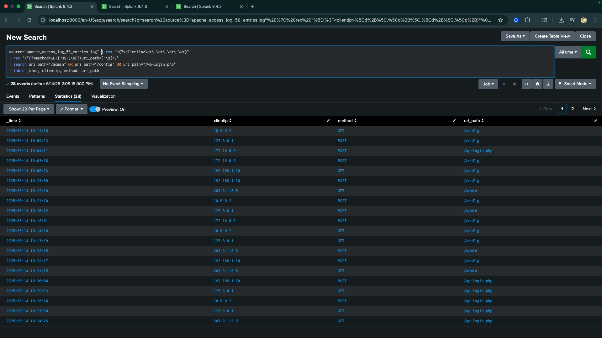
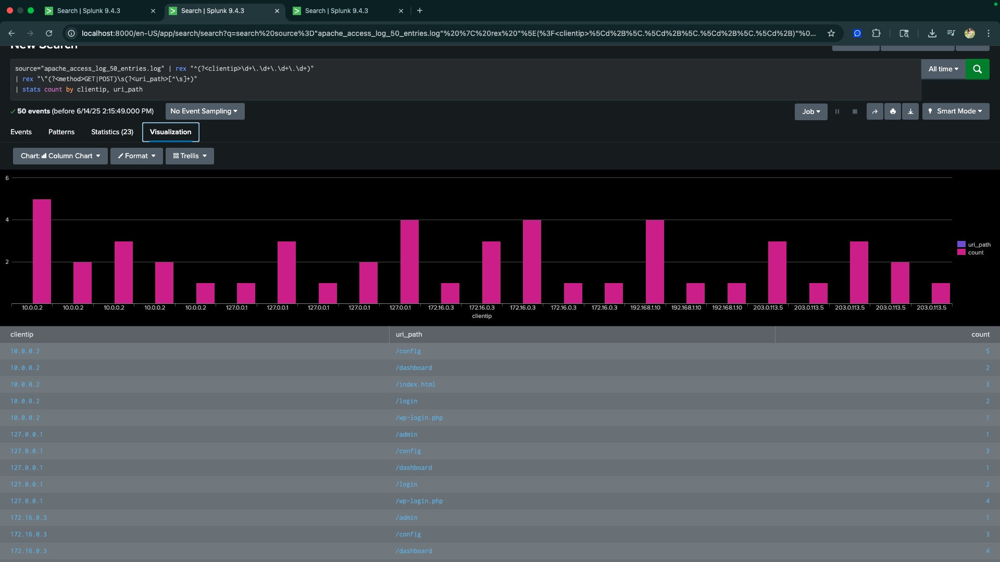
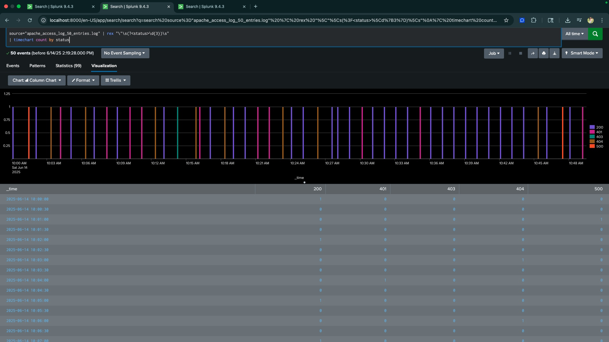

# SOC Detection Lab

## Objective

This lab uses a 50-entry sample Apache access log in Splunk to practice investigating authentication errors and requests to sensitive paths. I used field extraction, searches, and visualizations to identify activity worth reviewing. The sample does not include request bodies, user identities, or application authentication records, so the HTTP status codes alone cannot confirm a brute-force attack or unauthorized access.

### Skills practiced

- Analyzing Apache access logs for patterns that warrant follow-up.
- Interpreting HTTP methods, status codes, client IPs, and requested paths.
- Identifying patterns that warrant follow-up investigation without treating them as confirmed attacks.
- Using searches to group HTTP errors and requests to sensitive paths by client IP and time.
- Documenting observations with screenshots and written explanations.

### Tools used

- Splunk
- Apache access logs

## Steps

### Ref 1: Raw Log Data View

This screenshot shows the raw Apache access log entries successfully ingested into Splunk. It includes detailed fields such as timestamps, IP addresses, HTTP methods, status codes, and requested endpoints. This is the foundational step in the detection process, allowing me to visually inspect what types of requests were made and begin identifying abnormal or suspicious patterns.

### Ref 2: Reviewing 401 responses

This screenshot groups `401 Unauthorized` responses by client IP. A 401 response is a useful starting point for authentication review, but the sample is too small to establish repeated credential guessing. I would compare the request path, timing, source, and application sign-in records before drawing a conclusion.

### Ref 3: Field Extraction with Rex

I used the `rex` command in Splunk to extract the IP address and HTTP status code from raw Apache logs, allowing for easier filtering, grouping, and analysis of suspicious activity.

### Ref 4: Requests to sensitive paths

This screenshot highlights requests to paths such as `/admin`, `/config`, and `/wp-login.php`. Those paths merit closer review, especially when requests cluster by source and time. The paths alone do not establish reconnaissance or malicious intent.

### Ref 5: Visual IP-to-Path Breakdown

This chart compares client IPs and requested paths such as `/config`, `/wp-login.php`, and `/admin`. It helps prioritize sources for follow-up review; the counts alone do not prove scanning or brute-force behavior.

### Ref 6: Timechart of Status Codes

This timechart visualizes the frequency of different HTTP status codes over time. The chart shows when `401` (Unauthorized) and `404` (Not Found) responses occurred in this sample. With only 50 entries, a short-term increase is a lead to investigate rather than evidence of a specific attack.
